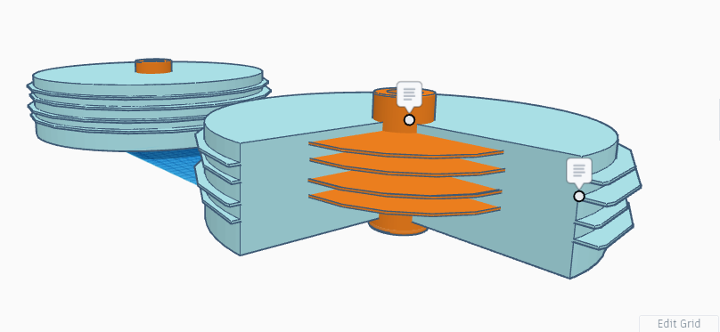
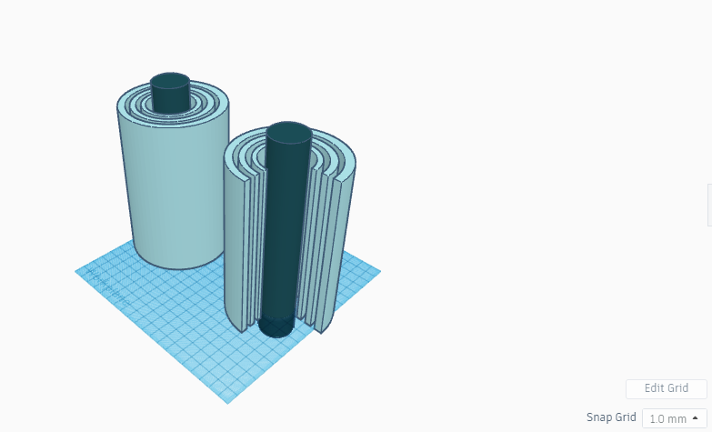

<h1>Electric Motor Prototypes</h1>

Here are electric motor prototypes which may become viable for commercial use 
 
 
<h2>Finned Disk Stator | Fanned Neodymium Rotor Electric Motor</h2>
<figure>

<figcaption>Caption: Fanned (Neodymium) Rotor Electric Motor prototype</figcaption>
</figure> 
 
The Finned-Stator | Fanned-Rotor design increases surface-area and, thus, the flux field density of the electric motor allowing the fanned rotor electric motor to achieve the acceleration and the torque of much larger motors 
 
 
<h2>Unified Stator | Neodymium Rotor Multistage Electric Motor</h2>
<figure>

<figcaption>Caption: Neodymium Electric Motor prototype w/ builtin multistage transmission</figcaption>
</figure> 
 
The Neodymium Rotor Electric Motor uses a unified rotor and stator for multistage velocity achievement. The inner or outer stator | rotors could be disabled to allow for energy re-capture, thereby decreasing top speed while increasing overall motor efficiency many orders of magnitude 
